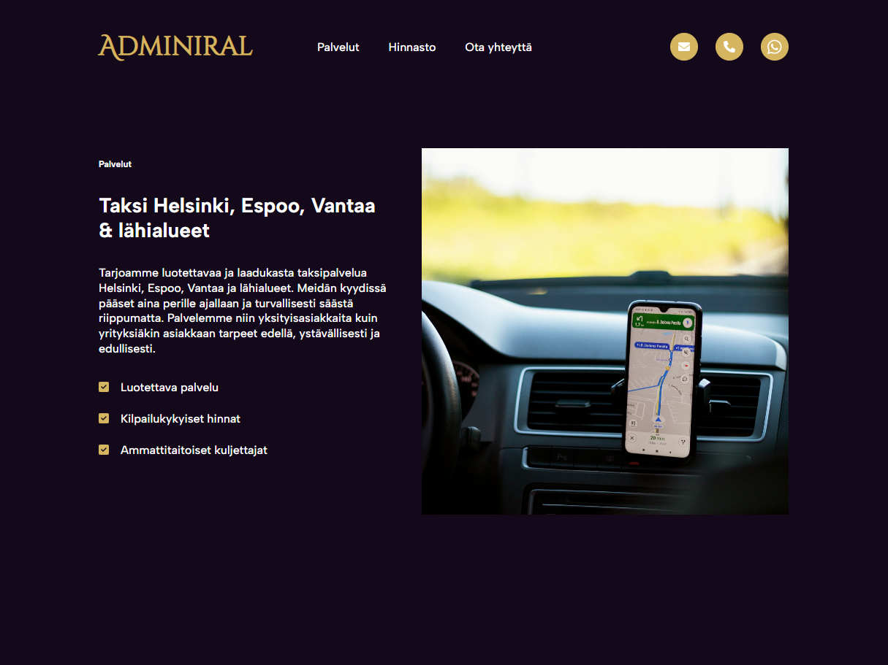

# WordPress block theme for an entrepreneur

This project is a **WordPress block theme**, built using Gutenberg blocks to create a modern, flexible, and fully customizable one-page website. The site functions as a digital visit card for an entrepreneur, showcasing services, pricing, and contact information.

The final version of the site is published at: <a href="https://adminiral.fi" target="_blank">https://adminiral.fi</a>

## Purpose & Goal
The website serves as a digital business card with the following objectives:
- Present the entrepreneur's services clearly.
- Display a price list.
- Offer a contact form for inquiries.
- Provide a responsive and SEO-optimized user experience.

## Visual Design
The visual design of the website was fully created, including:
- Logo design.
- Page templates.
- Color palette and font selection.
- Fonts were planned and paired using [Fontjoy](https://fontjoy.com/).

## Key Features
- **One-page layout:** All essential information is accessible on a single page.  
- **Contact form:** Allows potential clients to reach out easily.  
- **Responsiveness:** Optimized for mobile, tablet, and desktop.  
- **SEO-friendly:** Structured and optimized for search engines.  

## Custom Blocks
A custom WordPress block was created to manage and display pricing tables with full editor customization.  

### Features of the Custom Table Block
- Add or remove **rows and columns** dynamically.  
- Toggle a **header row** on or off.  
- Adjust **text alignment** (left, center, right).  
- Customize **cell padding** (value and units).  
- Change **colors** for:
  - Text
  - Table borders
  - Table background
  - Header row background
- Adjust **border width**.  

### Usage
1. Insert the custom "Pricing Table" block in the WordPress editor.
2. Use the block inspector to:
   - Add or delete rows/columns.
   - Enable a header row.
   - Customize styles such as colors, text alignment, padding, and borders.
3. Enter table cell content directly in the editor.

## Technologies Used
- WordPress 6.x
- Gutenberg Block Editor
- React.js (for custom block)
- SCSS/CSS
- JavaScript (ES6+)

## Screenshots

### 1. Adiminira.fi Logo

*The main logo of the website, showing the brand identity.*

### 2. Custom Table Block in Editor

*WordPress editor view of the custom Pricing Table block. The block allows adding/removing rows and columns, toggling header row, and customizing styles such as colors, padding, and borders.*

### 3. Site View

*Frontend view of the website displaying the Custom Tables block in action, integrated into the live site layout.*

